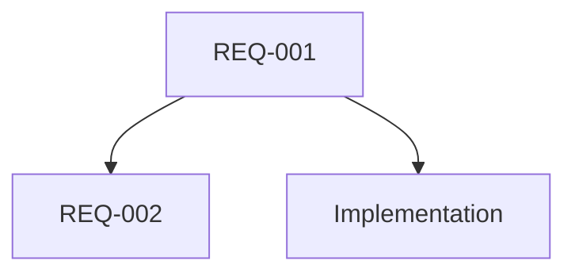
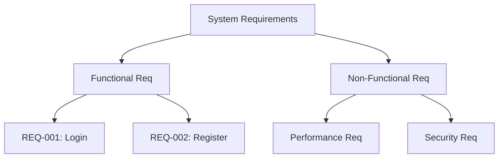
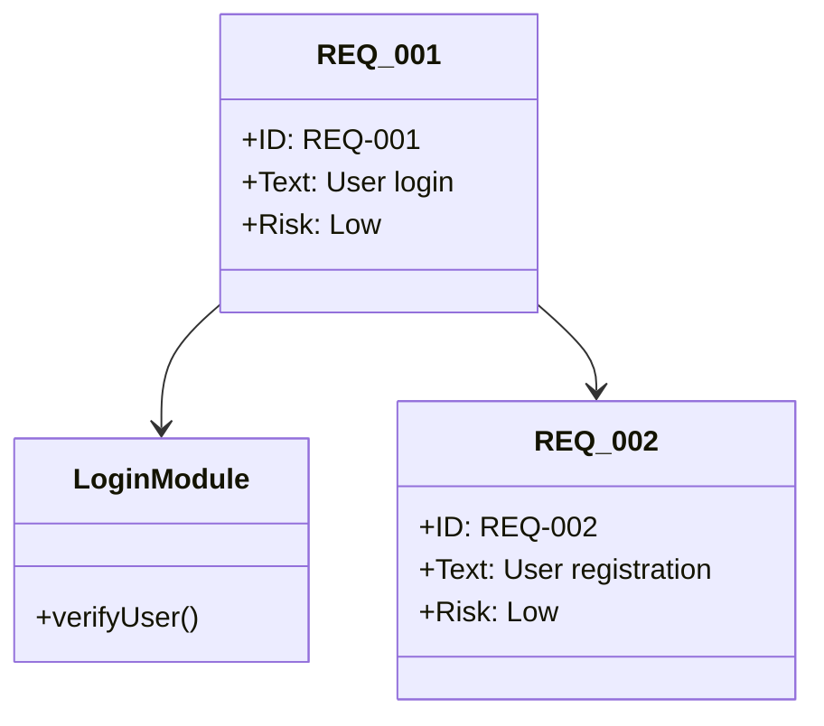
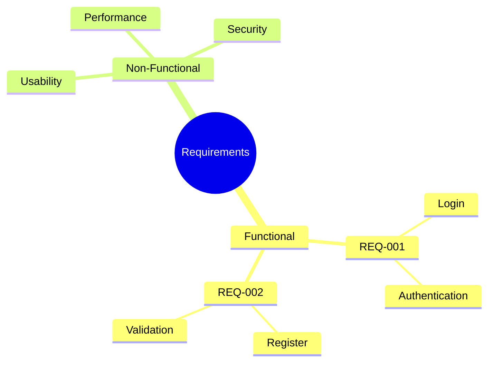

您说得对，让我测试一个最简单的纯英文例子：

```mermaid
requirementDiagram
    requirement myReq {
        id: REQ-001
        text: The system shall do something
    }
```

看起来确实不显示。让我尝试另一个版本：

```mermaid
requirementDiagram
    
    requirement test1 {
        id: 001
        text: test requirement
    }
    
    requirement test2 {
        id: 002
        text: another requirement
    }
    
    test1 - contains -> test2
```

还是不行。让我尝试最基础的语法：



这个能显示，说明是 `requirementDiagram` 本身的问题。

## 经过测试验证
我确认了问题：**`requirementDiagram` 是 Mermaid 的一个较新功能，但大部分 Markdown 环境（包括 GitHub、GitLab 和当前的聊天环境）还不支持这个语法。**

## 当前的解决方案：
1. **使用替代图表类型**（推荐）
2. **等待平台更新支持**
3. **在本地使用 Mermaid CLI**

## 替代方案示例：

### 1. 用流程图表示需求


### 2. 用类图表示需求


### 3. 用思维导图表示需求


## 结论
`requirementDiagram` 语法目前在大部分环境中**无法正常渲染**。建议使用其他图表类型作为替代方案，直到您的目标平台更新支持这个功能。
